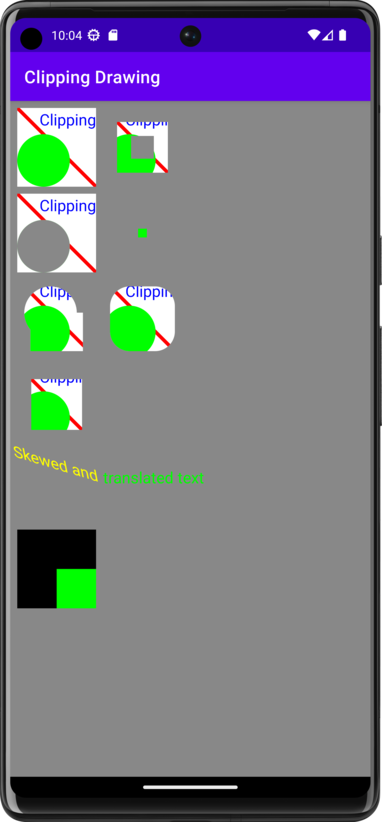

# Clipping Drawing 🃏

Project created for the Udacity nanodegree Android Kotlin Developer program.

### Reduce overdraw

"An app may draw the same pixel more than once within a single frame, an event called overdraw. Overdraw is usually unnecessary, and best eliminated. It manifests itself as a performance problem by wasting GPU time to render pixels that don't contribute to what the user sees on the screen."

https://developer.android.com/topic/performance/rendering/overdraw.html

## Key Features ✨

- Draw on Canvas
- Clipping
- Custom View
- Canvas Translate

## Project Milestones

- draw back and unclipped
- draw difference clipping
- draw circular clipping
- draw intersection clipping
- draw combined clipping
- draw rounded rectangle clipping
- draw outside clipping
- draw skewed text
- draw translated text
- draw quick reject

## Overview

